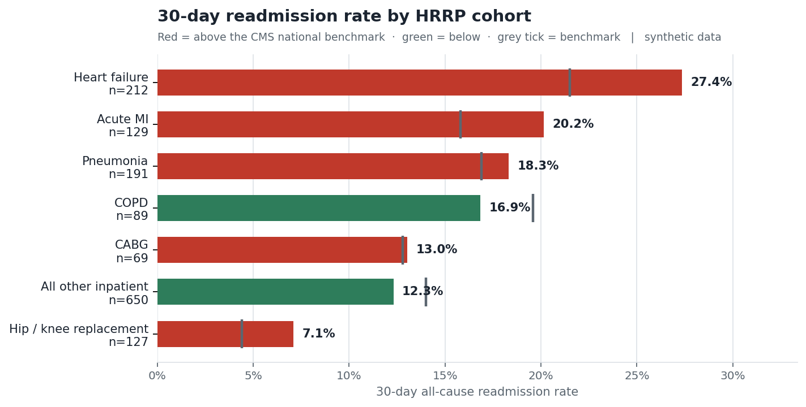

# 30-Day Readmission Analytics & HRRP Risk

A working analytics pipeline: synthetic inpatient encounters → PostgreSQL star schema →
30-day readmission logic → validated reporting views for BI.

Modelled on the CMS **Hospital Readmissions Reduction Program**, which penalises hospitals up to
3% of base Medicare DRG payments when 30-day all-cause readmission rates for six target conditions
exceed risk-adjusted national benchmarks.



**Interactive dashboard:** [HRRP Readmission Dashboard on Tableau Public](https://public.tableau.com/app/profile/sai.harika.gade/viz/HRRPReadmissionDashboard/Dashboard2)

**Synthetic data.** Generated locally, contains no PHI, derived from no real patient record.

---

## Run it

Needs PostgreSQL and Python 3.9+. Nothing else — no Synthea download, no Docker, no manual `createdb`.

```bash
git clone https://github.com/gadesaiharika/hrrp-readmission-analytics
cd hrrp-readmission-analytics
pip install -r requirements.txt
cp .env.example .env        # then put your PostgreSQL password in it
python run.py
```

About five seconds later you have a populated warehouse, 25 passing validation checks, and
dashboard extracts in `data/exports/`.

```
[1/8] Generating 3,000 synthetic patients (seed 42)
[4/8] Building dimensions and facts
       FactEncounter          11,920
       FactReadmission         1,467
[5/8] Applying incremental patient extract (SCD Type 2)
       expired 228 rows, inserted 228 successors
[7/8] Validating
       25 passed, 0 failed
OK — warehouse built and validated in 5.1s
```

Useful flags: `--patients N`, `--seed N`, `--validate-only`, `--generate-only`,
and `--csv-dir path/to/synthea/output/csv` to run the same pipeline against real Synthea output.

---

## What it found

On the generated cohort of 1,467 index inpatient admissions:

- **Heart failure is the dominant penalty exposure** — 27.4% vs a 21.5% national benchmark,
  5.9 points above, and the largest estimated excess cost of any cohort. It also carries the
  largest denominator among the named cohorts, so it is where intervention pays back most.
- **COPD is the second exposure, and it was hiding** — 25.0% on 176 admissions against a 19.6%
  benchmark, 5.4 points above. An earlier build reported it at 16.9% and *below* benchmark,
  because the classifier was missing half its admissions. See "A bug the checks missed" below.
- **Medicare readmits at 18.5% against 14.4% commercial** — a 4.2-point gap concentrated in
  precisely the population HRRP measures.
- **Case-mix adjustment reorders the provider list.** Ranking providers on raw rate flags whoever
  happens to carry the most heart failure. `vw_provider_outliers` weights each provider's own
  cohort mix by the national rates and compares against that, which is the only version of the
  ranking worth showing a service-line director.

Cohort ordering — heart failure worst, elective joint replacement best — matches the published
CMS pattern. That is a sanity check, not proof: the ordering held even while half of COPD was
misclassified.

---

## How it works

```
CSV (Synthea format) → raw_* staging → dimensions + facts → analytics views → extracts
```

| Layer | Contents |
|---|---|
| **Staging** | `raw_patients`, `raw_encounters`, `raw_conditions`, `raw_procedures`, `raw_payers`, `raw_providers`, `raw_organizations` |
| **Dimensions** | `DimPatient` (SCD Type 2), `DimDate`, `DimDiagnosis` (ICD-10 chapter rollup + HRRP cohort), `DimProvider`, `DimPayer`, `DimFacility` |
| **Facts** | `FactEncounter` — one row per encounter · `FactReadmission` — one row per index inpatient admission |
| **Views** | `vw_readmission_detail`, `vw_hrrp_cohort_summary`, `vw_readmission_monthly`, `vw_payer_mix`, `vw_provider_outliers`, `vw_service_line_heatmap` |

The 30-day logic is two window functions over the same partition:

```sql
WINDOW w AS (PARTITION BY patient_key ORDER BY admit_datetime)

LAG(discharge_datetime)  OVER w   -- was THIS admission a readmission?
LEAD(admit_datetime)     OVER w   -- was THIS admission followed by one?  <- HRRP numerator
```

Cohorts resolve from the principal diagnosis first (AMI, HF, pneumonia, COPD), then from
procedures (CABG, THA/TKA), then fall through to `OTHER`.

Reporting logic lives in SQL views rather than Tableau calculated fields, so the HRRP definitions
are reviewable, diffable, and testable instead of buried in a workbook.

| Path | |
|---|---|
| `run.py` | orchestrates all eight steps |
| `src/hrrp/generate.py` | synthetic data in Synthea's CSV format |
| `src/hrrp/validate.py` | the 25 checks |
| `sql/02_etl_readmission.sql` | dimensions, facts, readmission logic |
| `sql/03_scd2_apply_changes.sql` | SCD Type 2 merge |
| `sql/04_analytics_views.sql` | reporting layer |
| `docs/data_dictionary.md` | column-level dictionary |

---

## Validation

`python run.py --validate-only` runs 25 checks. They are the point of the project, not decoration —
readmission rate is a number people make staffing decisions with, and a silently duplicated join
would move it without anyone noticing.

**Structure** — fact grain uniqueness, no orphan foreign keys, unique diagnosis codes, no gaps in
the date dimension.
**SCD Type 2** — exactly one current row per patient, effective ranges that never overlap, expired
rows that have an end date and current rows that do not.
**Business logic** — every 30-day flag agrees with its own day count in both directions, no
readmission flagged without a prior encounter, discharge never precedes admission.
**Reconciliation** — `FactReadmission` covers exactly the discharged inpatient stays in
`FactEncounter`, and cohort subtotals sum to the fact total.
**Ranges** — rates that land outside a plausible band fail, because a cohort at 0% or 90% means
the window logic broke rather than that the hospital changed.

### A bug these checks caught

The day count and the flag derived from it were computed from two different expressions:

```sql
-- reported number: rounded
ROUND(EXTRACT(EPOCH FROM (next_admit - discharge)) / 86400.0)::INT  AS days_to_next_admission

-- flag: raw, unrounded
EXTRACT(EPOCH FROM (next_admit - discharge)) / 86400.0 BETWEEN 0 AND 30
```

A gap of 30.4 days reported as **30 days** while the flag read **false**. Filtering a dashboard on
`days_to_next_admission <= 30` therefore returned a different population than the headline
readmission rate — the kind of discrepancy that surfaces as a user saying "these two numbers don't
match" and is miserable to trace after the fact.

Fixed by computing the delta once and deriving both from it, using calendar-day subtraction rather
than timestamp arithmetic — which also matches the CMS definition, where the 30th calendar day
counts regardless of what hour either event happened at.

### A bug the checks missed

All 25 checks passed while half of COPD was being filed as "All other inpatient." The classifier
matched `'%chronic bronchitis%'`; the diagnosis text was "Chronic obstructive bronchitis," and the
word *obstructive* in the middle broke the match. COPD reported 89 admissions at 16.9%, below its
benchmark, when the true figure was 176 at 25.0%, above it.

It surfaced on the Tableau heatmap: 87 "All other" admissions sitting in Pulmonology at 33.3%, a
combination the data should not produce. The checks had two blind spots. A range check on cohort
share passed at 55.7%, because a classifier that fails on *some wordings* of a condition still lands
in a plausible band. And "HRRP cohort is always populated" could never fail at all — the column is
`NOT NULL` and the ETL defaults to `OTHER`.

That dead check is replaced with one that fails if any admission whose diagnosis names a target
condition falls through to `OTHER`. It fails with exactly 87 rows against the old build and passes
against the fixed one, which is the evidence that it tests the right thing.

---

## Why SCD Type 2 here

`DimPatient` versions on address change. An encounter from 2023 stays joined to where the patient
lived in 2023, so last quarter's regional numbers do not silently restate when someone moves.

```
patient_id  city         effective_start  effective_end  is_current
00e463c7…   Tupelo       1976-09-02       2026-08-25     false
00e463c7…   Starkville   2026-08-26       (null)         true
```

Ranges abut without overlapping — the invariant the validation suite enforces. `run.py` applies a
second patient extract in which roughly 8% of patients have moved, so the merge runs against real
changed data on every build rather than being asserted in a comment.

Address, city, and ZIP are tracked as Type 2. Birth date, gender, race, and ethnicity are corrected
in place as Type 1 — a change there is a data-quality fix, not a real-world event worth preserving.

---

## Limitations

Honest scope boundaries, not a disclaimer.

- **Synthetic data.** Realistic in shape, not drawn from any real population. The rates are
  properties of the generator, calibrated to the published CMS bands.
- **Every inpatient stay is treated as an index admission.** Real HRRP applies planned-readmission
  exclusions, transfer merging, and a minimum-eligibility threshold. Those are not implemented.
- **No risk standardisation.** CMS computes risk-standardised readmission ratios from
  hierarchical models over a three-year lookback. `est_excess_cost` here is a linear approximation
  for executive framing, not the payment-adjustment formula.
- **SNOMED, not ICD-10.** Synthea emits SNOMED-CT, so cohorts are matched on description text.
  A production Clarity build would key on ICD-10-CM principal diagnosis directly.
- **Modelled on Epic's publicly documented Clarity/Caboodle patterns.** No Epic software, licensed
  content, or production environment is involved.

---

## License

MIT — see [LICENSE](LICENSE).

Built by **Sai Harika Gade** · [LinkedIn](https://linkedin.com/in/saiharikagade) · gadesaiharika@gmail.com
